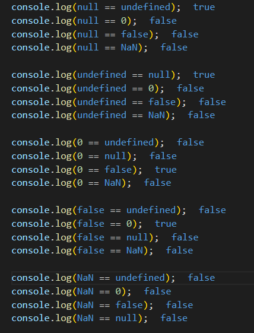

`Первый) вопрос: сколько ошибочных значений бывает`

*Первый) ответ: 6 видов бывает: Null, Undefined, 0 , false, " " , NaN*

`Второй) вопрос: отличие между "null" и "undefined"`

*Второй) ответ: "null"-это тип значения который имеет значение , но значение не имеет значения (пусто, без веса, нечего), но готов к заполнению, А вот "undefined" вообще не имеет занчения*

*В JavaScript null — это литерал и ключевое слово языка, которое представляет собой отсутствие какого-либо объекта. Другими словами, null указывает «в никуда». В свою очередь, хоть и похожий по смыслу undefined , олицетворяет отсутствие значения как такового.*

`Третий) вопрос: сравните ошибочные значения`

*Третий) ответ: *

`Четвёртый) вопрос: почему null == undefined = true`

*Четвёртый) ответ: Так как они оба указывают на пустоту элемента *